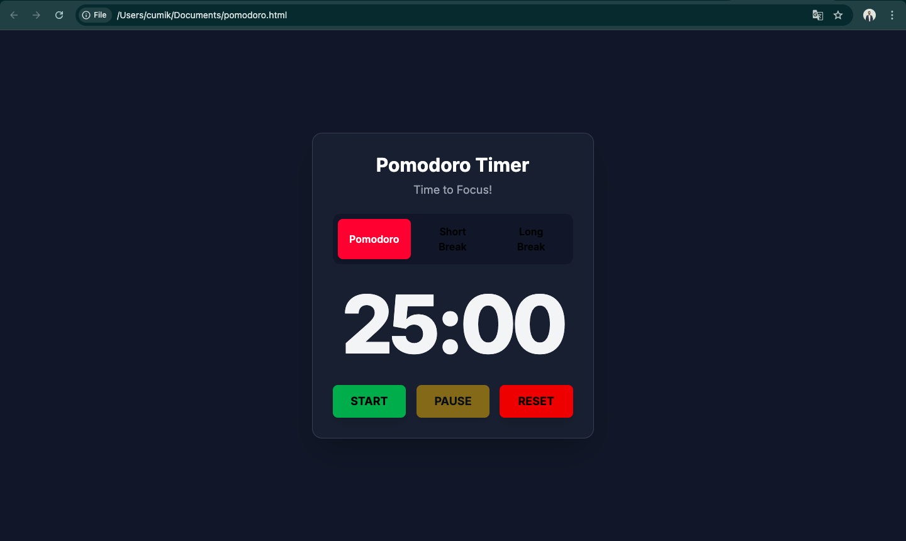

# Simple Pomodoro Timer 🍅

A clean, modern, and easy-to-use Pomodoro timer web application built with HTML, Tailwind CSS, and vanilla JavaScript. This single-file application requires no installation or setup—just open it in your browser and start focusing\!



## Features

  * **Three Timer Modes**: Standard **Pomodoro** (25 min), **Short Break** (5 min), and **Long Break** (15 min) to structure your work and rest periods.
  * **Simple Controls**: Intuitive **Start**, **Pause**, and **Reset** buttons for full control over your session.
  * **Automatic Cycling**: The timer automatically transitions between work and break sessions. A long break is suggested after every four Pomodoros.
  * **Audio Notifications**: A gentle sound alerts you when a session is complete, so you can stay focused without watching the clock.
  * **Dynamic Tab Title**: The remaining time is displayed in the browser tab, allowing you to see the current status at a glance.
  * **Responsive Design**: The interface looks and works great on both desktop and mobile devices.
  * **Zero Dependencies**: Everything is self-contained in a single HTML file using CDNs for external libraries.

-----

## How to Use

1.  **Download the File**: Save the `pomodoro.html` file to your computer.
2.  **Open in Browser**: Right-click the file and open it with any modern web browser like Chrome, Firefox, or Safari.
3.  **Start Focusing**: Choose a mode and click **START**\!

-----

## Technologies Used

  * **HTML5**: For the basic structure of the application.
  * **Tailwind CSS**: For modern and responsive styling, included via a CDN.
  * **JavaScript (ES6)**: For all the timer logic and interactivity.
  * **Tone.js**: A Web Audio framework used to generate the notification sounds, included via a CDN.
  * **Google Fonts**: For the clean "Inter" typeface.

-----

## File Structure

The entire application is contained within a single file for simplicity:

```
.
└── pomodoro.html
```

-----

## License

This project is open-source and available under the [MIT License](https://opensource.org/licenses/MIT).
